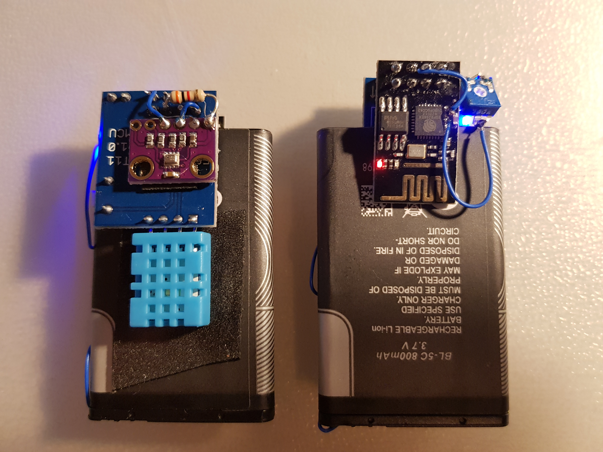
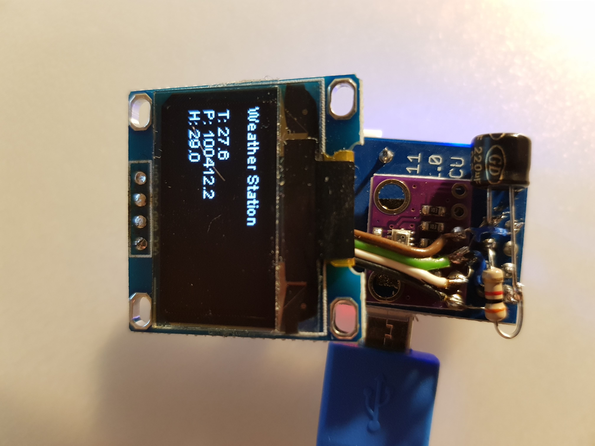

# ESPWeather
ESP-1S or ESP-12 weather station that publishes telemetry to a configured MQTT broker.
The device will try to connect to configured multiple Wifi networks and if no such were found, will try open networks.
Then it will connect to MQTT broker and announce telemetry data until 30 seconds elapses. In that case it will go to deep sleep for 30 minutes and the process begins.

There are three device variants: OLED, E-Paper and headless.
Also there is Web UI (TODO) that can be used for initial configuration or telemetry readings in AP mode if no networks are present.
Note, that after each UI query sleep timer will be reset, meaning that if one does not dwell too long(30s) will be able to use the device.
Websockets are used for telemetry transfer to the UI.

## Headless

These have no interface and are intended to place into various strange places. Like the balcony or the room.

## OLED

`ESP_WEATHER_VARIANT_OLED` must be enabled in `wificonfig.h` for that option before building. It will use a SSD1306 128x64 .96" OLED display and will display current telemetry info except for battery.

## E-Paper

`ESP_WEATHER_VARIANT_EPAPER` must be enabled in `wificonfig.h` for that option. `ESP_WEATHER_VARIANT_OLED` and `ESP_WEATHER_VARIANT_EPAPER` are mutually exclusive and the latter is only available when using ESP-12 module as SPI interface is required for it's operation. ESP-1 does not have enough pins for this feature.

TODO: build a prototype with E-Paper and find/create some library that talks to it.

## UI

TODO

# Construction

DHT11 and BMP280 modules are used in this device for prototypes.
SSD1306 and 3 color 2.13" E-Paper HAT are used for OLED and E-Paper variants respectively.
For E-Paper prototype Wemos D1 mini is used.

For battery management I used a TP4050 micro-usb module with protection circuitry. If one has Lipo/LiIon batteries with protection in possession, then protection-less charging boards can be used.

I plan adding a 6V solar panel so I could start measuring outside temperature without worrying about the battery.

OLED variant in the above picture does not use any charging circuitry as it is meant for always-connected (or battery-pack) usage.  

Cases for these can be 3D printed. TODO.

## Battery monitoring

I use 100k trim pot directly across battery connector to the DH11 board, trim it to 1/10th of the battery voltage and solder the center tap to a TOUT pin right to the ESP8266 chip.
I suggest flashing the ESP-1 module before soldering, so that the wire wouldn't be stressed to much.

## Deep Sleep function

For waking up from Deep sleep GPIO 16 must be connected to RST. So more fine soldering skills are required in case of ESP-1.

## Reducing current consumption

I've measured 1.8ma current in deep sleep.
That means that the device sleeps for 30 minutes with 1.8mA current consuming 1.8mAh(I assume it never goes away). During all the communication and measurements somewhere around 70-90 mA are flowing to the ESP. So let's say it's 75mA for 30s. That translates to 0.625mAh. Therefore 800mAh battery would last a long time (about 13 days).
Sadly, the batteries I am using in the photos are pretty much dead and charge up to around 75-120mAh. Which lasted for about 40 hours which confirms current consumption measurements and rough calculations to a degree.

That was with two LEDs being constantly lit and an onboard regulator. Which I am surprised by, by the way.
One can always remove those buggers, but I figured that with solar panel the device would run almost indefinitely and for home usage with a 800mAh battery

# Configuration

Please look at `sample_wificonfig.h` file, select relevant features, add default Wifi credentials, MQTT connection details and build.
Note, that wifi connection and MQTT are required if one wants to configure the device, e.g. changing the name or adding more access points.

# Topics being published by the device

## announce

Device will publish it's name to this topic once it connects to MQTT broker. Initially it will be a MAC address of the ESP.
One can configure a different name by publishing to `{device name}/name` a new name which will be saved on the device.

## {device name}/temperature

Temperature of the surroundings in celcius.

## {device name}/pressure

Air pressure of the surroundings in kPa.

## {device name}/humidity

Air relative humidity in percentage.

## {device name}/battery

Battery voltage in volts.

# Topics being subscribed by the Device

## {device name}/name

Publishing to this topic will change device name.

## {device name}/apadd

Publishing to this topic will add another Wifi Network.
One must supply a space delimited ssid and password, e.g. `ssid password`.
This will be saved to the device and it will try to connect to this and other saved APs on boot.

## {device name}/apremove

Publishing to this topic will remove the ap. One must publish ssid of the network that one wishes to remove.

## {device name}

This topic accepts following publishes:

### SLEEP

Forces the device to sleep for preset time (around 30 minutes).

### NOSLEEP

Disables sleeping of the devices. This does not percist after restart.
Useful for OTA development/etc.

### RESTART

Forces restart of the device.

### PING

Forces to announce it's name on `announce` topic.
Useful for device status monitoring.

# Things to note

Until now (20180216) ESP-01 with PUYA flash chips are not supported by the SPIFFS library (it can read uploaded, but not properly write files.).
As a workaround one can publish config topics with persistent messages. E.g. setting name of the device. Setting up Wifi in this fashion isn't really useful for obvious reasons though.
