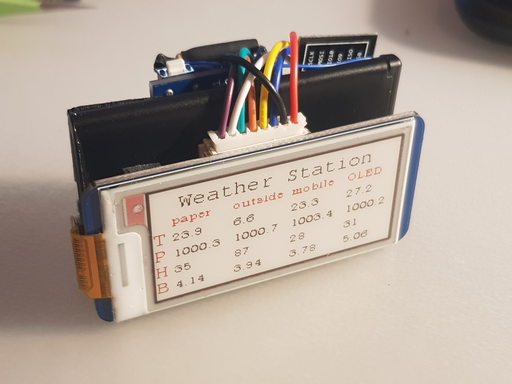
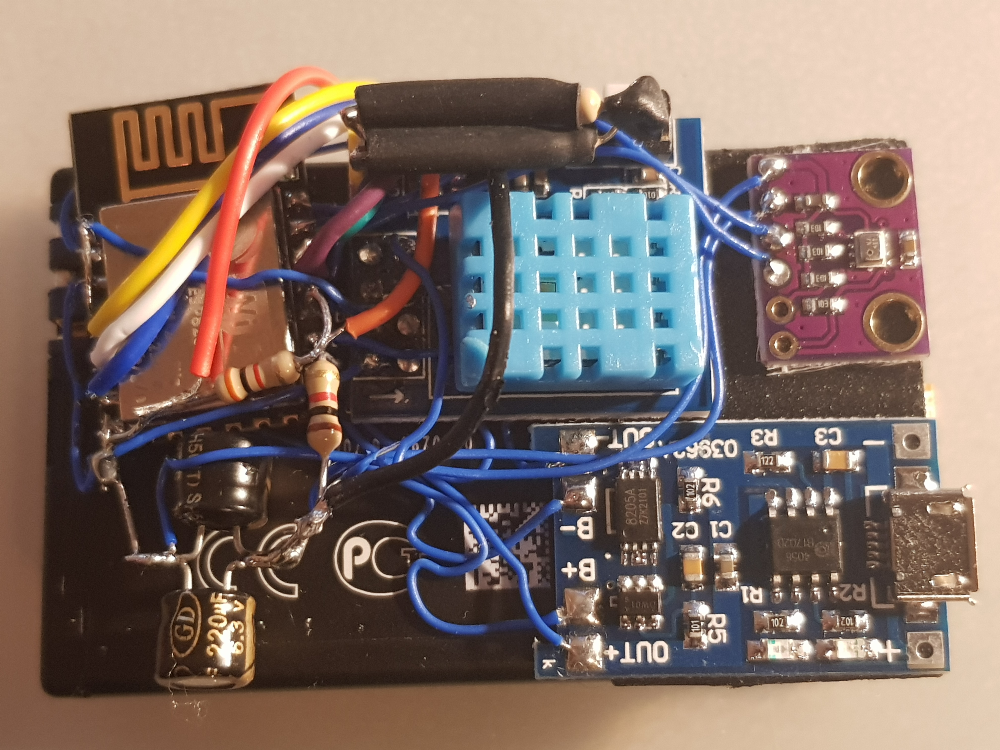

# ESPWeather



ESP-1S or ESP-12 weather station that publishes telemetry to a configured MQTT broker.
The station will try to connect to configured multiple Wifi networks and if no such were found, will try open networks.
Then it will connect to MQTT broker and announce telemetry data until 30 seconds elapses. In that case it will go to deep sleep for 30 minutes and the process starts over.

There are three station variants: OLED, E-Paper and Headless.
Also there is Web UI (TODO) that can be used for initial configuration or telemetry readings in AP mode if no networks are present.
Note, that after each UI query sleep timer will be reset, meaning that if one does not dwell for too long(30s) will be able to use the station until the battery dies.
Websockets are used for telemetry transfer to the UI.

## Features

* mDNS
* OTA
* Connect to free wifi or one of configured networks
* MQTT Pub/Sub
* Report temperature
* Report relative humidity
* Report air pressure
* Report battery voltage
* Monitor and display several other station telemetry
* Headless
* OLED display
* E-Paper display
* Configure Wifi networks via MQTT
* Configure station name via MQTT
* Configure station names to be monitored via MQTT
* Persistent telemetry MQTT messages

## General operation

Each station variant tries to connect to either open wifi or one of configured wifi networks giving priority to configured networks.
After that it tries to connect to a configured MQTT broker.
Once initial telemetry data is available, starts to publish telemetry data to MQTT broker every 1s.
After 30s of bootup will go to deep sleep.
After 30 minutes will wake up and repeats the cycle.
OLED/E-Paper variants also display gathered telemetry data.
Calculated power demand is around 1mAh and can be lowered by reducing time spend awaken and removing LEDs from ESP module. Also higher resistor value for voltage divider could be used.

## Headless


These have no user interface and are intended to be placed into various strange places. Like the balcony or the room. One of mine currently sits in the biology museum.

## OLED


`ESP_WEATHER_VARIANT_OLED` must be enabled in `wificonfig.h` for that option before building. It will use a SSD1306 128x64 .96" OLED display and will display current telemetry info except for battery.

## E-Paper

`ESP_WEATHER_VARIANT_EPAPER` must be enabled in `wificonfig.h` for that option. `ESP_WEATHER_VARIANT_OLED` and `ESP_WEATHER_VARIANT_EPAPER` are mutually exclusive and the latter is only available when using ESP-12 module as SPI interface is required for it's operation. ESP-1 does not have enough pins for this feature.



Please note, that for other variants esp01_1m board is used. E-Paper variant uses d1_mini board. I had some random issues flashing ESP-12 using esp01_1m board either via serial upload or OTA. Also, since RX and TX pins are used for I2C communication to the BMP280 sensor, once it is soldered OTA programming might be the only option.

The most desirable feature of this variant is that the display is so wide it can fit four readings. Station names that this variant can display are configured using `{station name}/name` MQTT message as described in relevant section below. First column is always the current station and three other are configurable.

## UI

TODO

# Building

PlatformIO is used for this project. Just clone the project, import it into platformio, select board info and build.
Flashing is also done this way. platformio.ini file contains some example upload_port values for OTA flashing. One can always use hostnames instead of ips. It's just that my bonjour service is confused because of different stations occupying the same hostname.

## Cloning

Since I use git submodules (for EasyOTA), cloning must be done using --recurse-submodules option:

```
git clone --recurse-submodules https://github.com/foxis/ESPWeather.git
```

# Construction

DHT11 and BMP280 modules are used in this station for prototypes. BME280 or even BME680 will be used in production.
SSD1306 and 3 colour 2.13" E-Paper HAT are used for OLED and E-Paper variants respectively.
For E-Paper prototype Wemos D1 mini was used and later replaced with standalone ESP-12F module.

For battery management I used a TP4050 micro-usb module with protection circuitry. If one has Lipo/LiIon batteries with protection in possession, then protection-less charging boards can be used. Mine boards have USB mini soldered which I personally do not like.

I plan adding a 6V solar panel so I could start measuring outside temperature without worrying about the battery.

OLED variant in the above picture does not use any charging circuitry as it is meant for always-connected (or battery-pack) usage. However please note, that most battery packs will disconnect the battery from the station once it goes into deep sleep mode.

Cases for these can be 3D printed. TODO.

* Rx is SCL
* Tx is SDA
* GPIO 2 is 1-Wire interface for DHT11
* GPIO 13, 14, 15, 5, 12, 4 are for EPD signals: DIN, CLK, CS, DC, RST, BUSY respectively
* TOUT or ADC is for battery monitoring and connected to battery input via 1/10 voltage divider (ADC can measure up to 1.0V, so this scale factor is quite convenient)
* sourced on Ebay: DHT11 for ESP-1S module, BMP280 board, TP4050 lipo micro-usb charger board, SSD1306 and 2.13" RPI-Zero E-Paper HAT (Waveshare)
* LiIon Batteries from various dead cell phones and cheap Chinese video registrators

## Schematics

Shall design proper boards with BME280 or BME680 with ldo, lipo charger and connector, with headers for OLED/EPaper.

## Battery monitoring

I use 100k trim pot directly across battery connector to the DH11 board, trim it to 1/10th of the battery voltage and solder the center tap to a TOUT pin right to the ESP8266 chip.
I suggest flashing the ESP-1 module before soldering, so that the wire wouldn't be stressed to much.
Discrete resistors for voltage divider can be seen in some the photos - this is because I ran out of trim pots:) And the dividing factor is not really precise, since I did not have 90k resistors and opted out for 2x51k + 10kx1k resistors. For the prototypes I am only interested in monitoring approximate voltage drop for the batteries and approximate point when DHT11 fails to provide meaningful readings.

At about 2.80V of battery voltage DHT11 library returns nan. This voltage is even too low for ESP, but surprisingly it survives until 2.65(minus voltage drop across ldo).

## Deep Sleep function

For waking up from Deep sleep GPIO 16 must be connected to RST. So more fine soldering skills are required in case of ESP-1. ESP-12 is more forgiving in that regard.

## Reducing current consumption

I've measured 1.8ma current in deep sleep.
That means that the station sleeps for 30 minutes with 1.8mA current consuming 1.8mAh(I assume it never goes away). During all the communication and measurements somewhere around 70-90 mA are flowing to the ESP. So let's say it's 75mA for 30s. That translates to 0.625mAh. Therefore 800mAh battery would last a long time (about 13 days).
Sadly, the batteries I am using in the photos are pretty much dead and charge up to around 75-120mAh. Which lasted for about 40 hours which confirms current consumption measurements and rough calculations to a degree.

That was with two LEDs being constantly lit and an onboard regulator. Which I am surprised by, by the way.
One can always remove those buggers, but I figured that with solar panel the station would run almost indefinitely and would have plenty of run time for home usage with a 800mAh battery.
By removing the blue LED current drops to ~400uA during deep sleep and the dead'est battery still runs for 4 days already at 3.75V.

# Configuration

Please look at `sample_wificonfig.h` file, select relevant features, add default Wifi credentials, MQTT connection details and build after selecting appropriate board.
Note, that wifi connection and MQTT are required if one wants to configure the station, e.g. changing the name or adding more access points.

# Topics being published by the station

## announce

Station will publish it's name to this topic once it connects to MQTT broker. Initially it will be a MAC address of the ESP.
One can configure a different name by publishing to `{station name}/name` a new name which will be saved on the station.

## {station name}/temperature

Temperature of the surroundings in deg. centigrade.

## {station name}/pressure

Air pressure of the surroundings in milli Bar.

## {station name}/humidity

Air relative humidity in percentage.

## {station name}/battery

Battery voltage in volts.

# Topics being subscribed by the station

## {station name}/name

Publishing to this topic will change station name.
Station name must not contain neither commas nor spaces as these symbols are reserved for E-Paper variant.
One can specify a list of station names separated by a space or comma, so that measurement from those stations can be monitored.
E.g. "paper OLED outside mobile" was used in the E-Paper variant shown in the photo.
That means, that E-Paper variant's name was set to "paper" and three other stations were monitored: OLED, outside and mobile.
Since each station published persistent telemetry messages, the latest data is being monitored and subsequently displayed on the E-Paper display.

## {station name}/apadd

Publishing to this topic will add another Wifi Network.
One must supply a space delimited ssid and password, e.g. `ssid password`.
This will be saved to the station and it will try to connect to this and other saved APs on boot.

## {station name}/apremove

Publishing to this topic will remove the ap. One must publish ssid of the network that one wishes to remove.

## {station name}

This topic accepts following publishes:

### SLEEP

Forces the station to sleep for preset time (around 30 minutes).

### NOSLEEP

Disables sleeping of the stations. This does not percist after restart.
Useful for OTA development/etc.

### RESTART

Forces restart of the station.

### PING

Forces to announce it's name on `announce` topic.
Useful for station status monitoring.


# Things to note

## RX/TX pins
Due to pin count limitation on ESP-1 RX and TX pins are used for I2C bus. I2C stations seem to survive initial burst of boot info that is fed during bootup, but programming via serial while these pins are still connected to OLED/BMP280 is not advised. I've tried it, but ESP-12 module does not boot.

## SPIFFS
Until now (20180216) ESP-01 with PUYA flash chips are not supported by the SPIFFS library (it can read uploaded, but not properly write files.).
As a workaround one can publish config topics with persistent messages. E.g. setting name of the station. Setting up Wifi in this fashion isn't really useful for obvious reasons though.

## BMP280
For some reason very first measurement is way too high (both temperature and pressure). I've tried several libraries with no luck. In fact Adafruit_BMP280 library gives way too high readings all the time. The one I'm using currently (BMP280) is simplistic and allows to set different oversampling values and gives the most accurate readings except for the very first.
To remediate that I skip several first readings.

## DHT11
Sometimes DHT11 will not read any data. And most of the time when the battery is almost depleted (<2.8V) there are no readings.

# Icons

Icons made by https://www.flaticon.com/authors/pixel-perfect Pixel perfect from www.flaticon.com is licensed by http://creativecommons.org/licenses/by/3.0/ Creative Commons BY 3.0


# License

MIT License

Copyright (c) 2018 foxis (Andrius Mikonis <andrius.mikonis@gmail.com>)

Permission is hereby granted, free of charge, to any person obtaining a copy
of this software and associated documentation files (the "Software"), to deal
in the Software without restriction, including without limitation the rights
to use, copy, modify, merge, publish, distribute, sublicense, and/or sell
copies of the Software, and to permit persons to whom the Software is
furnished to do so, subject to the following conditions:

The above copyright notice and this permission notice shall be included in all
copies or substantial portions of the Software.

THE SOFTWARE IS PROVIDED "AS IS", WITHOUT WARRANTY OF ANY KIND, EXPRESS OR
IMPLIED, INCLUDING BUT NOT LIMITED TO THE WARRANTIES OF MERCHANTABILITY,
FITNESS FOR A PARTICULAR PURPOSE AND NONINFRINGEMENT. IN NO EVENT SHALL THE
AUTHORS OR COPYRIGHT HOLDERS BE LIABLE FOR ANY CLAIM, DAMAGES OR OTHER
LIABILITY, WHETHER IN AN ACTION OF CONTRACT, TORT OR OTHERWISE, ARISING FROM,
OUT OF OR IN CONNECTION WITH THE SOFTWARE OR THE USE OR OTHER DEALINGS IN THE
SOFTWARE.
